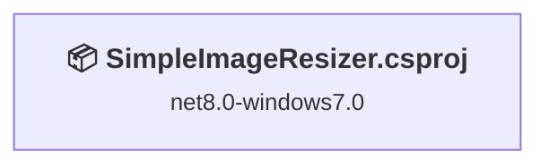
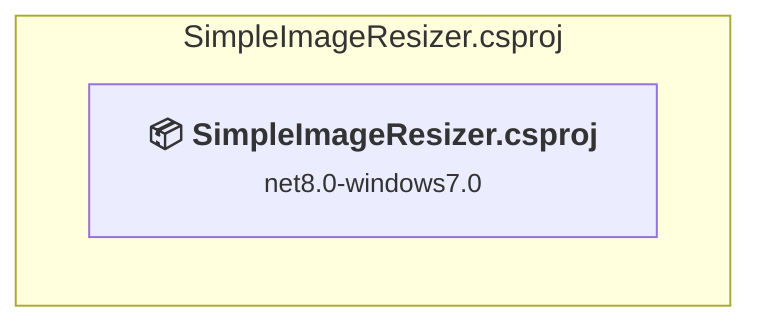

# Projects and dependencies analysis

This document provides a comprehensive overview of the projects and their dependencies in the context of upgrading to .NETCoreApp,Version=v10.0.

## Table of Contents

- [Executive Summary](#executive-Summary)
  - [Highlevel Metrics](#highlevel-metrics)
  - [Projects Compatibility](#projects-compatibility)
  - [Package Compatibility](#package-compatibility)
  - [API Compatibility](#api-compatibility)
- [Aggregate NuGet packages details](#aggregate-nuget-packages-details)
- [Top API Migration Challenges](#top-api-migration-challenges)
  - [Technologies and Features](#technologies-and-features)
  - [Most Frequent API Issues](#most-frequent-api-issues)
- [Projects Relationship Graph](#projects-relationship-graph)
- [Project Details](#project-details)

  - [SimpleImageResizer\SimpleImageResizer.csproj](#simpleimageresizersimpleimageresizercsproj)

## Executive Summary

### Highlevel Metrics

| Metric | Count | Status |
| :--- | :---: | :--- |
| Total Projects | 1 | All require upgrade |
| Total NuGet Packages | 2 | 1 need upgrade |
| Total Code Files | 38 |  |
| Total Code Files with Incidents | 28 |  |
| Total Lines of Code | 4409 |  |
| Total Number of Issues | 941 |  |
| Estimated LOC to modify | 939+ | at least 21.3% of codebase |

### Projects Compatibility

| Project | Target Framework | Difficulty | Package Issues | API Issues | Est. LOC Impact | Description |
| :--- | :---: | :---: | :---: | :---: | :---: | :--- |
| [SimpleImageResizer\SimpleImageResizer.csproj](#simpleimageresizersimpleimageresizercsproj) | net8.0-windows7.0 | 🟡 Medium | 1 | 939 | 939+ | Wpf, Sdk Style = True |

### Package Compatibility

| Status | Count | Percentage |
| :--- | :---: | :---: |
| ✅ Compatible | 1 | 50.0% |
| ⚠️ Incompatible | 0 | 0.0% |
| 🔄 Upgrade Recommended | 1 | 50.0% |
| ***Total NuGet Packages*** | ***2*** | ***100%*** |

### API Compatibility

| Category | Count | Impact |
| :--- | :---: | :--- |
| 🔴 Binary Incompatible | 840 | High - Require code changes |
| 🟡 Source Incompatible | 61 | Medium - Needs re-compilation and potential conflicting API error fixing |
| 🔵 Behavioral change | 38 | Low - Behavioral changes that may require testing at runtime |
| ✅ Compatible | 2934 |  |
| ***Total APIs Analyzed*** | ***3873*** |  |

## Aggregate NuGet packages details

| Package | Current Version | Suggested Version | Projects | Description |
| :--- | :---: | :---: | :--- | :--- |
| CsvHelper | 30.0.1 |  | [SimpleImageResizer.csproj](#simpleimageresizersimpleimageresizercsproj) | ✅Compatible |
| Microsoft.Data.Sqlite | 7.0.2 | 10.0.5 | [SimpleImageResizer.csproj](#simpleimageresizersimpleimageresizercsproj) | NuGet package upgrade is recommended |

## Top API Migration Challenges

### Technologies and Features

| Technology | Issues | Percentage | Migration Path |
| :--- | :---: | :---: | :--- |
| WPF (Windows Presentation Foundation) | 523 | 55.7% | WPF APIs for building Windows desktop applications with XAML-based UI that are available in .NET on Windows. WPF provides rich desktop UI capabilities with data binding and styling. Enable Windows Desktop support: Option 1 (Recommended): Target net9.0-windows; Option 2: Add <UseWindowsDesktop>true</UseWindowsDesktop>. |
| Legacy Configuration System | 28 | 3.0% | Legacy XML-based configuration system (app.config/web.config) that has been replaced by a more flexible configuration model in .NET Core. The old system was rigid and XML-based. Migrate to Microsoft.Extensions.Configuration with JSON/environment variables; use System.Configuration.ConfigurationManager NuGet package as interim bridge if needed. |

### Most Frequent API Issues

| API | Count | Percentage | Category |
| :--- | :---: | :---: | :--- |
| T:System.Windows.Controls.Button | 42 | 4.5% | Binary Incompatible |
| T:System.Windows.Visibility | 40 | 4.3% | Binary Incompatible |
| T:System.Windows.Media.Imaging.BitmapFrame | 33 | 3.5% | Binary Incompatible |
| T:System.Windows.Window | 24 | 2.6% | Binary Incompatible |
| T:System.Uri | 23 | 2.4% | Behavioral Change |
| T:System.Windows.Media.Imaging.BitmapImage | 21 | 2.2% | Binary Incompatible |
| T:System.Windows.Controls.MenuItem | 21 | 2.2% | Binary Incompatible |
| T:System.Windows.RoutedEventHandler | 20 | 2.1% | Binary Incompatible |
| T:System.Windows.Controls.ContentControl | 20 | 2.1% | Binary Incompatible |
| T:System.Windows.Media.Imaging.BitmapCacheOption | 19 | 2.0% | Binary Incompatible |
| T:System.Windows.Media.Imaging.BitmapCreateOptions | 19 | 2.0% | Binary Incompatible |
| P:System.Configuration.ApplicationSettingsBase.Item(System.String) | 18 | 1.9% | Source Incompatible |
| P:System.Windows.ResourceDictionary.Item(System.Object) | 18 | 1.9% | Binary Incompatible |
| P:System.Windows.Controls.ContentControl.Content | 18 | 1.9% | Binary Incompatible |
| T:System.Windows.Controls.TextBlock | 16 | 1.7% | Binary Incompatible |
| T:System.Windows.Media.Imaging.Rotation | 15 | 1.6% | Binary Incompatible |
| F:System.Windows.Visibility.Collapsed | 13 | 1.4% | Binary Incompatible |
| P:System.Windows.UIElement.Visibility | 12 | 1.3% | Binary Incompatible |
| T:System.Windows.Input.TextCompositionEventHandler | 10 | 1.1% | Binary Incompatible |
| T:System.Windows.RoutedEventArgs | 10 | 1.1% | Binary Incompatible |
| M:System.Windows.Window.#ctor | 10 | 1.1% | Binary Incompatible |
| T:System.Windows.Application | 9 | 1.0% | Binary Incompatible |
| M:System.Uri.#ctor(System.String,System.UriKind) | 9 | 1.0% | Behavioral Change |
| M:System.Configuration.ApplicationSettingsBase.Save | 8 | 0.9% | Source Incompatible |
| M:System.Windows.Media.Imaging.BitmapFrame.Create(System.Windows.Media.Imaging.BitmapSource) | 8 | 0.9% | Binary Incompatible |
| P:System.Windows.FrameworkElement.DataContext | 8 | 0.9% | Binary Incompatible |
| T:System.Media.SystemSounds | 8 | 0.9% | Source Incompatible |
| T:System.Media.SystemSound | 8 | 0.9% | Source Incompatible |
| P:System.Media.SystemSounds.Exclamation | 8 | 0.9% | Source Incompatible |
| M:System.Media.SystemSound.Play | 8 | 0.9% | Source Incompatible |
| P:System.Windows.Window.Owner | 7 | 0.7% | Binary Incompatible |
| T:System.Windows.Size | 6 | 0.6% | Binary Incompatible |
| M:System.Windows.Media.Imaging.BitmapEncoder.Save(System.IO.Stream) | 6 | 0.6% | Binary Incompatible |
| P:System.Windows.Media.Imaging.BitmapEncoder.Frames | 6 | 0.6% | Binary Incompatible |
| M:System.Uri.#ctor(System.String) | 6 | 0.6% | Behavioral Change |
| T:System.Windows.Media.Brushes | 6 | 0.6% | Binary Incompatible |
| T:System.Windows.Media.SolidColorBrush | 6 | 0.6% | Binary Incompatible |
| T:System.Windows.FontWeight | 6 | 0.6% | Binary Incompatible |
| E:System.Windows.Controls.Primitives.ButtonBase.Click | 6 | 0.6% | Binary Incompatible |
| M:System.Windows.Application.LoadComponent(System.Object,System.Uri) | 6 | 0.6% | Binary Incompatible |
| P:System.Windows.Controls.Button.IsDefault | 6 | 0.6% | Binary Incompatible |
| T:System.Windows.WindowStartupLocation | 6 | 0.6% | Binary Incompatible |
| M:System.Windows.Window.ShowDialog | 5 | 0.5% | Binary Incompatible |
| T:System.Windows.Media.DrawingBrush | 5 | 0.5% | Binary Incompatible |
| T:System.Windows.Media.Imaging.TiffCompressOption | 5 | 0.5% | Binary Incompatible |
| T:System.Windows.Media.Imaging.PngInterlaceOption | 5 | 0.5% | Binary Incompatible |
| M:System.Windows.Media.Imaging.BitmapImage.EndInit | 5 | 0.5% | Binary Incompatible |
| P:System.Windows.Media.Imaging.BitmapImage.CreateOptions | 5 | 0.5% | Binary Incompatible |
| P:System.Windows.Media.Imaging.BitmapImage.CacheOption | 5 | 0.5% | Binary Incompatible |
| P:System.Windows.Media.Imaging.BitmapImage.UriSource | 5 | 0.5% | Binary Incompatible |

## Projects Relationship Graph

Legend:
📦 SDK-style project
⚙️ Classic project

## Project Details

### SimpleImageResizer\SimpleImageResizer.csproj

#### Project Info

- **Current Target Framework:** net8.0-windows7.0
- **Proposed Target Framework:** net10.0-windows
- **SDK-style**: True
- **Project Kind:** Wpf
- **Dependencies**: 0
- **Dependants**: 0
- **Number of Files**: 42
- **Number of Files with Incidents**: 28
- **Lines of Code**: 4409
- **Estimated LOC to modify**: 939+ (at least 21.3% of the project)

#### Dependency Graph

Legend:
📦 SDK-style project
⚙️ Classic project

### API Compatibility

| Category | Count | Impact |
| :--- | :---: | :--- |
| 🔴 Binary Incompatible | 840 | High - Require code changes |
| 🟡 Source Incompatible | 61 | Medium - Needs re-compilation and potential conflicting API error fixing |
| 🔵 Behavioral change | 38 | Low - Behavioral changes that may require testing at runtime |
| ✅ Compatible | 2934 |  |
| ***Total APIs Analyzed*** | ***3873*** |  |

#### Project Technologies and Features

| Technology | Issues | Percentage | Migration Path |
| :--- | :---: | :---: | :--- |
| WPF (Windows Presentation Foundation) | 523 | 55.7% | WPF APIs for building Windows desktop applications with XAML-based UI that are available in .NET on Windows. WPF provides rich desktop UI capabilities with data binding and styling. Enable Windows Desktop support: Option 1 (Recommended): Target net9.0-windows; Option 2: Add <UseWindowsDesktop>true</UseWindowsDesktop>. |
| Legacy Configuration System | 28 | 3.0% | Legacy XML-based configuration system (app.config/web.config) that has been replaced by a more flexible configuration model in .NET Core. The old system was rigid and XML-based. Migrate to Microsoft.Extensions.Configuration with JSON/environment variables; use System.Configuration.ConfigurationManager NuGet package as interim bridge if needed. |

